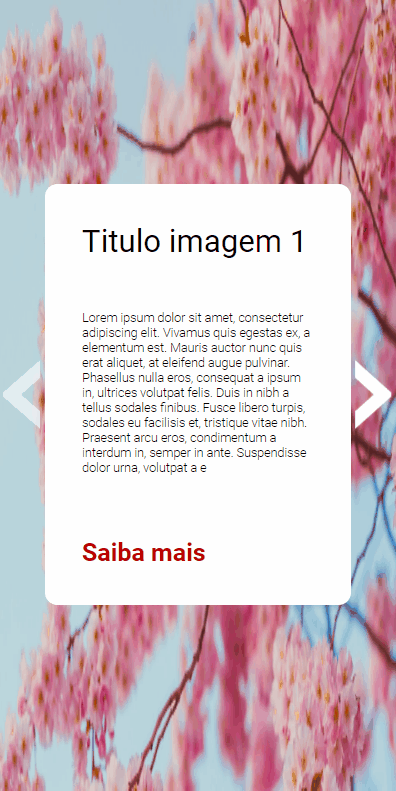
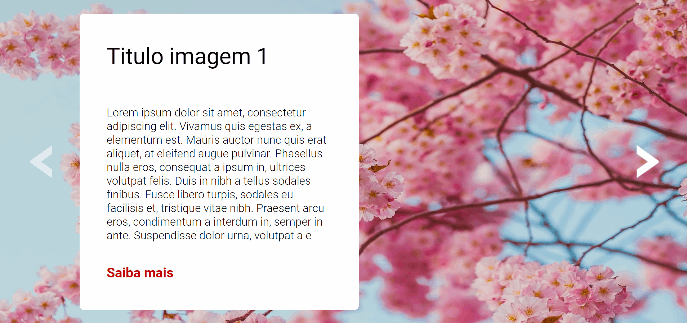

<h1 align="center">
   Carrossel de imagens
</h1>

 

## 💻 Projeto

Carrossel de imagens feito com JavaScript para trocar as imagens ao clicar nas setas.

## 📷 Demonstração

  ### Mobile 📱  
  

   
  
  ### Desktop 💻
  

 

## 🚀 Tecnologias utilizadas:

✔️ JAVASCRIPT

✔️ HTML

✔️ CSS